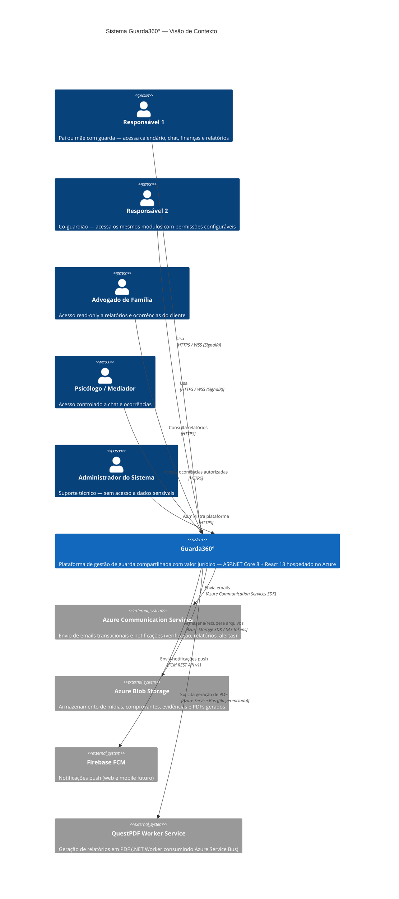

# 01 — C4 Level 1: Diagrama de Contexto — Guarda360°

**Versão**: 2.0 | **Agente**: @the-architect | **Data**: 2026-02-24  
**Alteração**: Backend .NET 8 | Cloud Azure

---

## Diagrama de Contexto (C4-L1)

---

## Descrição dos Atores

| Ator | Tipo | Interação Principal |
|------|------|---------------------|
| Responsável 1 | Usuário Primário | Todas as funcionalidades do app |
| Responsável 2 | Usuário Primário | Todas as funcionalidades (mesmas permissões configuráveis) |
| Advogado de Família | Usuário Secundário | Consulta relatórios e ocorrências de clientes |
| Psicólogo/Mediador | Usuário Secundário | Acesso read-only controlado |
| Administrador | Usuário Interno | Gestão da plataforma (sem dados pessoais) |

## Sistemas Externos

| Sistema | Tipo | Propósito |
|---------|------|-----------|
| Azure Communication Services (Email) | Azure PaaS | Email transacional — verificação de conta, notificações, entrega de relatórios |
| Azure Blob Storage | Azure PaaS | Fotos, comprovantes, áudios, PDFs gerados — SAS tokens para acesso seguro |
| Firebase FCM | SaaS Google | Push notifications para web e mobile (futuro) |
| QuestPDF Worker Service | Internal Worker .NET | Renderização de relatórios legais em PDF com hash SHA-256 |
