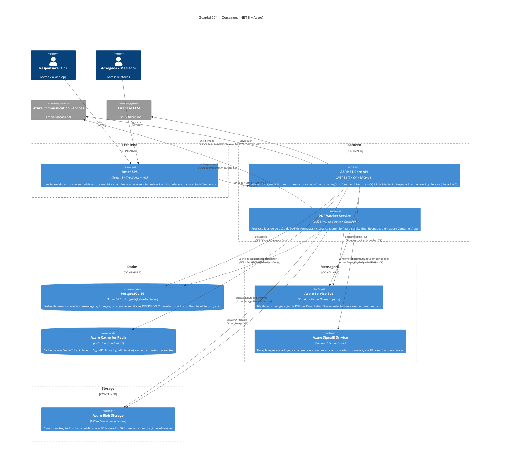

# 02 — C4 Level 2: Diagrama de Containers — Guarda360°

**Versão**: 2.0 | **Agente**: @the-architect | **Data**: 2026-02-24  
**Alteração**: Backend .NET 8 + ASP.NET Core | Cloud Azure

---

## Diagrama de Containers (C4-L2)

---

## Descrição dos Containers

### React SPA (Frontend)
- **Tecnologia**: React 18 + TypeScript + Vite + Tailwind + shadcn/ui
- **Responsabilidade**: Interface do usuário completa — todas as telas do MVP
- **Comunicação**: REST para dados + SignalR WebSocket para chat em tempo real
- **Hospedagem**: Azure Static Web Apps (CDN global integrado, deploy direto do GitHub Actions)

### ASP.NET Core API (Backend)
- **Tecnologia**: .NET 8 LTS + C# + Entity Framework Core 8 + MediatR (CQRS)
- **Responsabilidade**: Toda a lógica de negócio — autenticação, RBAC, calendário, chat, finanças, ocorrências, relatórios
- **Comunicação**: REST (HTTP) + SignalR WebSocket para chat
- **Hospedagem**: Azure App Service (Linux, P1v3) com slot de staging para blue-green deployment
- **Padrão**: Clean Architecture (Domain → Application → Infrastructure → API)

### PDF Worker Service
- **Tecnologia**: .NET 8 Worker Service + QuestPDF + Azure.Messaging.ServiceBus
- **Responsabilidade**: Processar jobs de geração de PDF assincronamente
- **Comunicação**: Consome fila Azure Service Bus → Consulta PostgreSQL → Gera PDF (QuestPDF) → Salva Blob Storage → Notifica por email
- **Hospedagem**: Azure Container Apps (serverless — paga apenas durante o processamento)

### Azure Database for PostgreSQL Flexible Server
- **Responsabilidade**: Persistência principal de todos os dados
- **Hospedagem**: Azure Database for PostgreSQL Flexible Server (B2ms — 2 vCores, 8 GB RAM)
- **Configuração especial**: INSERT-only triggers em tabelas jurídicas, Row Level Security ativo, PITR backup 35 dias

### Azure Cache for Redis (Standard C1)
- **Responsabilidade**: Cache de sessões JWT/refresh tokens, backplane do SignalR, cache de queries de relatório
- **Hospedagem**: Azure Cache for Redis (1 GB, Standard C1 — com réplica de failover)

### Azure Blob Storage
- **Responsabilidade**: Armazenamento de arquivos binários (comprovantes, áudios, fotos, evidências, PDFs)
- **Configuração**: Containers privados, SAS tokens com expiração configurável (presigned URLs), lifecycle rules para tier de acesso

### Azure Service Bus
- **Responsabilidade**: Fila de jobs para geração de PDFs — garante entrega exactly-once
- **Configuração**: Standard tier, Dead Letter Queue ativo, retentativas automáticas (5x), lock duration 5 min

### Azure SignalR Service
- **Responsabilidade**: Backplane gerenciado para WebSocket do chat — elimina necessidade de Redis Pub/Sub apenas para WebSocket
- **Configuração**: Standard tier, 1 unit (1.000 conexões simultâneas), modo serverless compatível
