# 03 — C4 Level 3: Diagrama de Componentes (ASP.NET Core API) — Guarda360°

**Versão**: 2.0 | **Agente**: @the-architect | **Data**: 2026-02-24  
**Alteração**: NestJS → ASP.NET Core 8 + Clean Architecture + CQRS (MediatR)

---

## Diagrama de Componentes — ASP.NET Core API (C4-L3)

```mermaid
C4Component
    title Guarda360° — Componentes ASP.NET Core API (.NET 8)

    Container_Boundary(dotnet, "ASP.NET Core API (.NET 8)") {
        Component(authModule, "Auth Module", "ASP.NET Core Identity + JWT Bearer + TOTP", "Login, registro, verificação de email, refresh token rotation, 2FA TOTP")
        Component(usersModule, "Users Module", "ASP.NET Core Controller + EF Core", "CRUD de usuários, perfis, permissões por perfil — RBAC Policy-based")
        Component(childrenModule, "Children Module", "ASP.NET Core Controller + EF Core", "CRUD de filhos, vínculo entre responsáveis, convite co-guardião")
        Component(calendarModule, "Calendar Module", "ASP.NET Core Controller + EF Core", "Calendário de convivência, check-in/check-out, registro de cumprimento")
        Component(chatModule, "Chat Module", "ASP.NET Core SignalR Hub + EF Core", "SignalR Hub, mensagens INSERT-ONLY, marcação de relevância, detecção de linguagem ofensiva")
        Component(financialModule, "Financial Module", "ASP.NET Core Controller + EF Core", "Pensão, despesas extras, comprovantes, status automático")
        Component(incidentsModule, "Incidents Module", "ASP.NET Core Controller + EF Core + SHA256", "Ocorrências, evidências, hash SHA-256 via System.Security.Cryptography, classificação de severidade")
        Component(reportsModule, "Reports Module", "ASP.NET Core Controller + Azure Service Bus", "Linha do tempo, enfileira job de PDF no Service Bus, status de geração, hash do relatório")
        Component(notificationsModule, "Notifications Module", "ASP.NET Core Service + FCM + Azure Email", "Push notifications via Firebase FCM e emails via Azure Communication Services")
        Component(storageModule, "Storage Module", "ASP.NET Core Service + Azure Blob SDK", "Upload/download com SAS tokens, gerenciamento de lifecycle e containers")
        Component(rbacPolicy, "RBAC Policy Handler", "ASP.NET Core Authorization + EF Core", "Policy-based authorization — valida perfil e permissões em todos os endpoints via IAuthorizationHandler")
        Component(mediatorPipeline, "MediatR Pipeline", "MediatR + FluentValidation Behaviors", "Pipeline CQRS — ValidationBehavior, LoggingBehavior, AuditBehavior em todos os Commands/Queries")
    }

    ContainerDb(postgres, "PostgreSQL (EF Core)")
    ContainerDb(redis, "Azure Cache for Redis")
    Container(signalR, "Azure SignalR Service")
    Container(blob, "Azure Blob Storage")
    Container(serviceBus, "Azure Service Bus")
    System_Ext(fcm, "Firebase FCM")
    System_Ext(azureEmail, "Azure Communication Services")

    Rel(authModule, postgres, "Lê/Escreve usuários + refresh tokens", "EF Core")
    Rel(authModule, redis, "Armazena refresh tokens + blacklist JWT", "StackExchange.Redis")
    Rel(usersModule, postgres, "CRUD usuários e permissões", "EF Core")
    Rel(childrenModule, postgres, "CRUD filhos e vínculos", "EF Core")
    Rel(childrenModule, azureEmail, "Envia email de convite", "Azure Communication Services SDK")
    Rel(calendarModule, postgres, "CRUD eventos — INSERT-ONLY para registros de cumprimento", "EF Core")
    Rel(chatModule, postgres, "Persiste mensagens — INSERT-ONLY (Interceptor EF Core)", "EF Core")
    Rel(chatModule, signalR, "Broadcast mensagens em tempo real", "Azure SignalR Service SDK")
    Rel(chatModule, storageModule, "Upload de mídia (áudios, arquivos)", "internal")
    Rel(financialModule, postgres, "CRUD pensão e despesas", "EF Core")
    Rel(financialModule, storageModule, "Upload comprovantes de pagamento", "internal")
    Rel(incidentsModule, postgres, "Ocorrências INSERT-ONLY + hash SHA-256", "EF Core")
    Rel(incidentsModule, storageModule, "Upload de evidências (fotos, docs)", "internal")
    Rel(reportsModule, postgres, "Lê dados consolidados para timeline", "EF Core (read-only)")
    Rel(reportsModule, serviceBus, "Enfileira job PDF na fila 'pdf-jobs'", "Azure Service Bus SDK")
    Rel(notificationsModule, fcm, "Push notifications para dispositivos", "FCM REST API v1")
    Rel(notificationsModule, azureEmail, "Emails transacionais e relatórios", "Azure Communication Services SDK")
    Rel(storageModule, blob, "Upload/Download/SAS token generation", "Azure Storage SDK")
    Rel(rbacPolicy, usersModule, "Valida perfil e permissões do usuário autenticado", "internal")
    Rel(mediatorPipeline, postgres, "AuditBehavior persiste audit_log", "EF Core")
```



---

## Módulos .NET — Responsabilidades e Contratos

| Módulo | Endpoints Principais | Tabelas EF Core |
|--------|---------------------|-----------------|
| **Auth** | POST /auth/register, /auth/login, /auth/refresh, /auth/verify-email, /auth/2fa/enable | users, refresh_tokens |
| **Users** | GET/PUT /users/me, GET /users/{id}/profile | users, user_profiles |
| **Children** | POST /children, GET /children, POST /invite, POST /invite/accept | children, parent_child, invites |
| **Calendar** | GET/POST/PUT /calendar/events, POST /attendance/checkin | calendar_events, attendance_records |
| **Chat** | SignalR Hub /chatHub, GET /messages, POST /messages/mark-relevant | messages, message_attachments |
| **Financial** | POST/GET /alimony, POST /expenses, POST /expenses/{id}/approve | alimony_configs, expenses, payments |
| **Incidents** | POST/GET /incidents, POST /incidents/{id}/evidence | incidents, incident_evidences |
| **Reports** | POST /reports/generate, GET /reports/{id}/status, GET /timeline | reports, (todas as tabelas read) |
| **Notifications** | (INotificationService interno) | notification_logs |
| **Storage** | POST /storage/upload, GET /storage/sas-token | (Blob Storage metadata) |
| **RBAC Policy** | (IAuthorizationHandler global via middleware) | user_roles, permissions |

## Estrutura Clean Architecture (pastas do projeto)

```
src/
  Guarda360.Domain/           ← Entidades, Value Objects, Domain Events, Interfaces
  Guarda360.Application/      ← Commands, Queries, Handlers (MediatR), DTOs, Validators (FluentValidation)
  Guarda360.Infrastructure/   ← EF Core DbContext, Repositories, Azure SDK clients, Identity
  Guarda360.API/              ← Controllers, SignalR Hubs, Middlewares, Program.cs
  Guarda360.Worker/           ← .NET Worker Service (PDF Worker — Azure Container Apps)
tests/
  Guarda360.Domain.Tests/
  Guarda360.Application.Tests/
  Guarda360.Integration.Tests/
```
