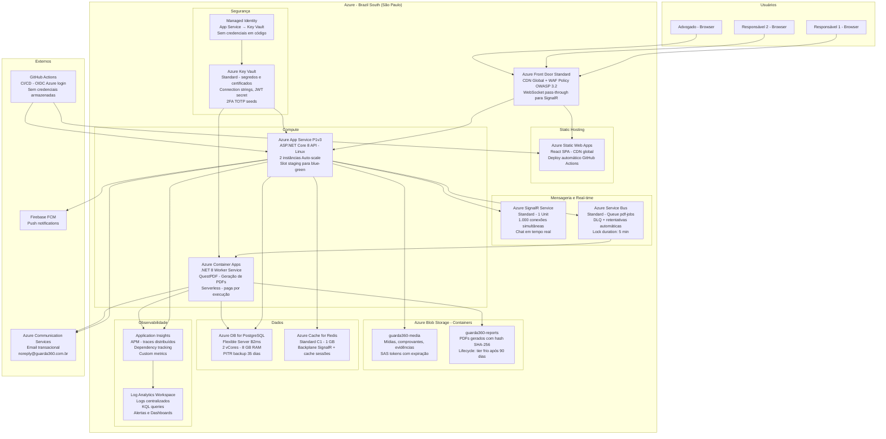

# 04 — Diagrama de Infraestrutura — Guarda360°

**Versão**: 2.0 | **Agente**: @the-architect | **Data**: 2026-02-24  
**Alteração**: AWS → Microsoft Azure | Backend .NET 8

---

## Infraestrutura Azure — MVP



---

## Configuração de Rede (Virtual Network + Private Endpoints)

| Componente | Inbound | Outbound | Acesso |
|-----------|---------|---------|--------|
| Azure Front Door | 0.0.0.0/0 :443 | App Service :443, Static Web Apps | Público |
| App Service | Front Door :443 | PostgreSQL, Redis, Blob, SignalR, Service Bus | VNet Integration |
| Container Apps | Service Bus (pull) | PostgreSQL, Blob, ACS | VNet Integration |
| PostgreSQL Flexible Server | App Service + Container Apps | — | Private Endpoint |
| Azure Cache for Redis | App Service | — | Private Endpoint |
| Azure Blob Storage | App Service + Container Apps | — | Private Endpoint |
| Azure Service Bus | App Service (send) + Container Apps (receive) | — | Private Endpoint |
| Azure SignalR Service | App Service + Clients via Front Door | — | Gerenciado |

---

## CI/CD Pipeline (GitHub Actions + Azure OIDC)

```yaml
Trigger: push to main branch

Jobs:
  1. test:
     - dotnet test (unit + integration)
     - npm test (frontend)

  2. build-frontend:
     - npm run build
     - Deploy: Azure Static Web Apps Action (OIDC)

  3. build-backend:
     - dotnet publish -c Release
     - docker build -t guarda360-api .
     - docker push ACR (guarda360.azurecr.io)
     - az webapp deploy (swap staging → production)

  4. build-worker:
     - dotnet publish -c Release
     - docker build -t guarda360-worker .
     - docker push ACR
     - az containerapp update --image guarda360-worker:sha-{commit}

  5. migrate:
     - dotnet ef database update (via Azure CLI task)
     - Executado no slot staging antes do swap
```

---

## Configuração do Azure Key Vault (segredos gerenciados)

| Segredo | Descrição |
|---------|-----------|
| `ConnectionStrings--DefaultConnection` | PostgreSQL connection string |
| `ConnectionStrings--Redis` | Azure Cache for Redis connection string |
| `AzureSignalR--ConnectionString` | Azure SignalR Service connection string |
| `AzureServiceBus--ConnectionString` | Azure Service Bus connection string |
| `AzureStorage--ConnectionString` | Azure Blob Storage connection string |
| `AzureCommunicationServices--ConnectionString` | ACS Email connection string |
| `JwtSettings--Secret` | Chave HMAC-SHA256 para assinar tokens JWT (256 bits) |
| `Firebase--ServiceAccountJson` | JSON de credenciais do Firebase Admin SDK |

> Todos acessados via **Managed Identity** (App Service → Key Vault) — zero credenciais em variáveis de ambiente ou código.
