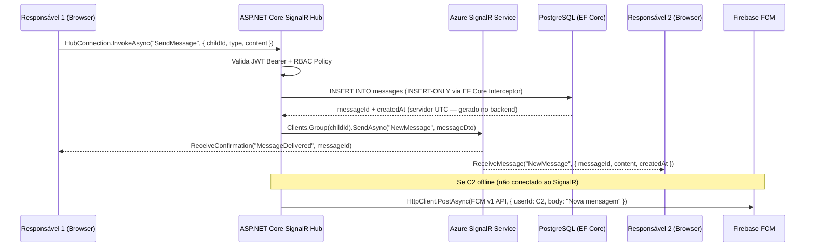
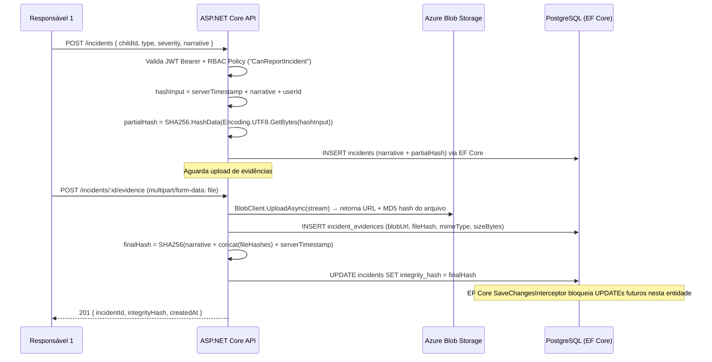
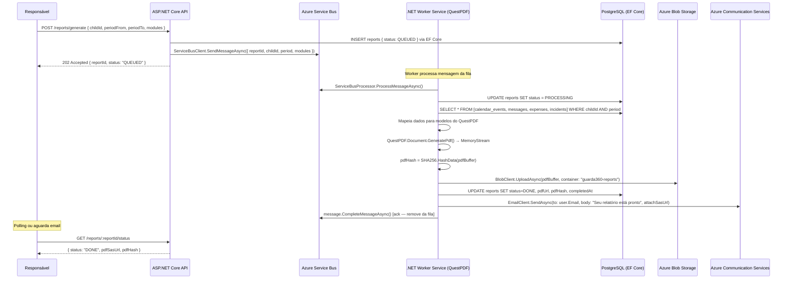
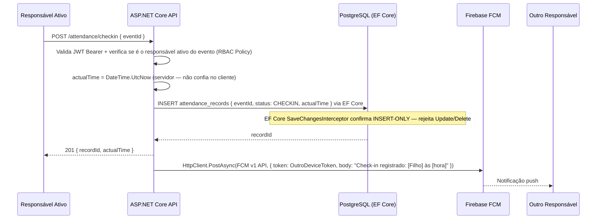
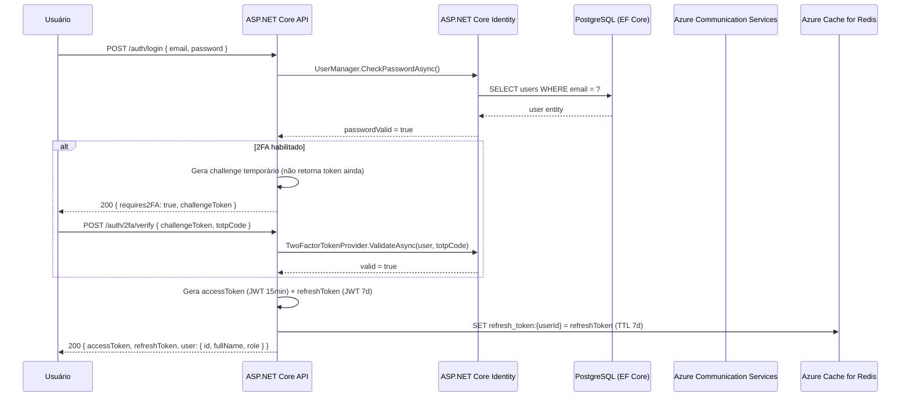

# 05 — Diagrama de Fluxo de Dados — Guarda360°

**Versão**: 2.0 | **Agente**: @the-architect | **Data**: 2026-02-24  
**Alteração**: NestJS/Node.js → ASP.NET Core 8 / .NET 8 | AWS → Azure

---

## Fluxo 1: Envio de Mensagem no Chat (SignalR)

---

## Fluxo 2: Registro de Ocorrência com Hash SHA-256

---

## Fluxo 3: Geração de Relatório PDF Assíncrono (Azure Service Bus + QuestPDF)

---

## Fluxo 4: Check-in de Visita

---

## Fluxo 5: Autenticação com 2FA (TOTP)

