# 06 — Diagrama ER — Guarda360°

**Versão**: 2.0 | **Agente**: @the-architect | **Data**: 2026-02-24  
**Nota**: Modelo de dados mantido — PostgreSQL permanece no Azure (Flexible Server). EF Core substitui Prisma ORM.

---

## Diagrama Entidade-Relacionamento

```mermaid
erDiagram
    USERS {
        uuid id PK
        string full_name
        string cpf_hash "hash do CPF"
        string email UK
        string password_hash
        boolean email_verified
        string avatar_url
        timestamp created_at
        timestamp updated_at
        boolean is_active
    }

    CHILDREN {
        uuid id PK
        string full_name
        date birth_date
        string school_name
        string photo_url
        timestamp created_at
    }

    PARENT_CHILD {
        uuid id PK
        uuid user_id FK
        uuid child_id FK
        enum role "GUARDIAN_1 | GUARDIAN_2 | THIRD_PARTY"
        enum custody_type "SHARED | SOLE | VISITATION"
        boolean is_active
        timestamp created_at
    }

    INVITES {
        uuid id PK
        uuid invited_by FK
        uuid child_id FK
        string email
        string token_hash
        timestamp expires_at
        boolean accepted
        timestamp created_at
    }

    CALENDAR_EVENTS {
        uuid id PK
        uuid child_id FK
        uuid created_by FK
        enum type "REGULAR | HOLIDAY | VACATION | SPECIAL"
        uuid responsible_user_id FK
        timestamp start_at
        timestamp end_at
        boolean is_recurring
        string recurrence_rule
        timestamp created_at
    }

    ATTENDANCE_RECORDS {
        uuid id PK
        uuid calendar_event_id FK
        uuid recorded_by FK
        enum status "CHECKIN | CHECKOUT | DELAY | ABSENCE | CANCELLATION"
        timestamp actual_time "timestamp servidor"
        integer delay_minutes
        text observation
        timestamp created_at "immutable"
    }

    MESSAGES {
        uuid id PK
        uuid child_id FK
        uuid sender_id FK
        enum type "TEXT | AUDIO | FILE"
        text content
        string attachment_url
        boolean is_legally_relevant
        boolean offensive_detected
        timestamp created_at "immutable - servidor"
    }

    ALIMONY_CONFIGS {
        uuid id PK
        uuid child_id FK
        uuid payer_id FK
        uuid receiver_id FK
        enum value_type "FIXED | PERCENTAGE"
        decimal amount
        decimal percentage
        integer due_day
        boolean is_active
        timestamp created_at
    }

    ALIMONY_PAYMENTS {
        uuid id PK
        uuid alimony_config_id FK
        uuid paid_by FK
        decimal amount_paid
        date payment_date
        date reference_month
        string receipt_url
        enum status "PAID | PENDING | OVERDUE | CONTESTED"
        timestamp created_at
    }

    EXPENSES {
        uuid id PK
        uuid child_id FK
        uuid created_by FK
        enum category "HEALTH | SCHOOL | LEISURE | OTHER"
        decimal amount
        decimal payer1_share
        decimal payer2_share
        text description
        string receipt_url
        enum status "PENDING | APPROVED | CONTESTED | EXPIRED"
        text contest_reason
        timestamp expires_at
        timestamp created_at
    }

    INCIDENTS {
        uuid id PK
        uuid child_id FK
        uuid reported_by FK
        enum type "PARENTAL_ALIENATION | CUSTODY_BREACH | RISK | OTHER"
        enum severity "LOW | MEDIUM | HIGH | CRITICAL"
        text narrative
        string integrity_hash "SHA-256"
        timestamp created_at "immutable - servidor"
    }

    INCIDENT_EVIDENCES {
        uuid id PK
        uuid incident_id FK
        string file_url
        string file_hash "SHA-256 do arquivo"
        string mime_type
        bigint file_size_bytes
        timestamp uploaded_at "immutable"
    }

    REPORTS {
        uuid id PK
        uuid child_id FK
        uuid requested_by FK
        date period_from
        date period_to
        jsonb modules_included
        enum status "QUEUED | PROCESSING | DONE | ERROR"
        string pdf_url
        string pdf_hash "SHA-256"
        timestamp requested_at
        timestamp completed_at
    }

    AUDIT_LOG {
        uuid id PK
        uuid user_id FK
        string action
        string entity_type
        uuid entity_id
        jsonb metadata
        string ip_address
        timestamp created_at "immutable"
    }

    USERS ||--o{ PARENT_CHILD : "é responsável"
    CHILDREN ||--o{ PARENT_CHILD : "tem responsáveis"
    USERS ||--o{ INVITES : "convida"
    CHILDREN ||--o{ INVITES : "para filho"
    CHILDREN ||--o{ CALENDAR_EVENTS : "tem eventos"
    CALENDAR_EVENTS ||--o{ ATTENDANCE_RECORDS : "tem registros"
    CHILDREN ||--o{ MESSAGES : "tem mensagens"
    CHILDREN ||--o{ ALIMONY_CONFIGS : "tem pensão"
    ALIMONY_CONFIGS ||--o{ ALIMONY_PAYMENTS : "tem pagamentos"
    CHILDREN ||--o{ EXPENSES : "tem despesas"
    CHILDREN ||--o{ INCIDENTS : "tem ocorrências"
    INCIDENTS ||--o{ INCIDENT_EVIDENCES : "tem evidências"
    CHILDREN ||--o{ REPORTS : "tem relatórios"
    USERS ||--o{ AUDIT_LOG : "gera logs"
```



---

## Notas de Implementação

### ORM: Entity Framework Core 8
O modelo é mapeado via **EF Core 8** com Fluent API no `ApplicationDbContext`:
- `modelBuilder.Entity<Message>().ToTable("messages")` com configuração INSERT-only via Interceptor
- `DbContextOptionsBuilder.AddInterceptors(new ImmutableEntitiesInterceptor())` — bloqueia SaveChanges com Update/Delete para entidades marcadas com `[Immutable]`
- Migrations gerenciadas via `dotnet ef migrations add` e aplicadas no CI/CD (slot staging antes do swap)

### Tabelas INSERT-ONLY (imutabilidade jurídica)
Dupla camada de proteção: trigger PostgreSQL + EF Core SaveChanges Interceptor:
- `attendance_records` — `[Immutable]` no Domain + trigger SQL
- `messages` — `[Immutable]` no Domain + trigger SQL
- `incidents` — `[Immutable]` pós-finalização do hash + trigger SQL
- `incident_evidences` — `[Immutable]` no Domain + trigger SQL
- `audit_log` — `[Immutable]` no Domain + trigger SQL

```sql
-- Trigger PostgreSQL (camada de banco — última linha de defesa)
CREATE RULE no_update_messages AS ON UPDATE TO messages DO INSTEAD NOTHING;
CREATE RULE no_delete_messages AS ON DELETE TO messages DO INSTEAD NOTHING;
-- (repete para attendance_records, incidents, incident_evidences, audit_log)
```

### Row Level Security (RLS)
Ativo nas tabelas principais — cada responsável só vê dados do seu filho:
- `calendar_events` — filtrado por `parent_child.user_id`
- `messages` — filtrado por `parent_child.child_id`
- `incidents` — filtrado por `reported_by` (ocorrência é privada ao autor no MVP)

### Criptografia
- `cpf_hash`: CPF armazenado como `SHA256.HashData(Encoding.UTF8.GetBytes(cpf + salt))` — não reversível no MVP
- `password_hash`: `PasswordHasher<User>` do ASP.NET Core Identity (PBKDF2 + HMAC-SHA512, 600.000 iterações)
- `integrity_hash`: `SHA256.HashData()` via `System.Security.Cryptography` — calculado sobre todos os campos da ocorrência + hashes dos arquivos

### Índices Críticos
```sql
CREATE INDEX idx_messages_child_created ON messages(child_id, created_at DESC);
CREATE INDEX idx_attendance_event ON attendance_records(calendar_event_id, created_at);
CREATE INDEX idx_incidents_child_severity ON incidents(child_id, severity, created_at DESC);
CREATE INDEX idx_expenses_child_status ON expenses(child_id, status, created_at DESC);
```

### Conexão ao Azure Database for PostgreSQL
```csharp
// appsettings.json (valor vem do Azure Key Vault via Managed Identity)
// "ConnectionStrings:DefaultConnection": "Host=guarda360-db.postgres.database.azure.com;..."

builder.Services.AddDbContext<ApplicationDbContext>(options =>
    options.UseNpgsql(
        builder.Configuration.GetConnectionString("DefaultConnection"),
        npgsql => npgsql.EnableRetryOnFailure(maxRetryCount: 5)
    )
    .AddInterceptors(new ImmutableEntitiesInterceptor(), new AuditInterceptor())
);
```
